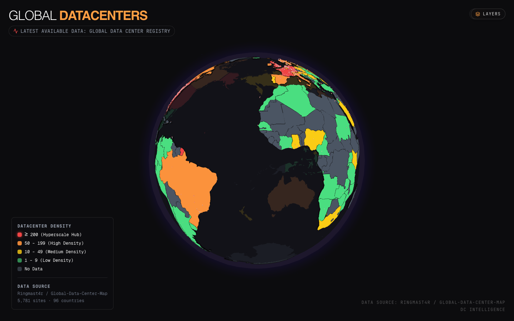

# 🌐 Datacenter Globe

> Interactive 3D atlas of the world's compute infrastructure. ~18,000 datacenters, every public-cloud region, the global submarine cable network, and a 3D walkthrough of an AI data center.

**Live:** **https://datacenter-globe.vercel.app**



---

## What it does

- **3D globe** of 18,116 datacenters across 96 countries, colored by density bucket
- **Search** any country, operator, or named datacenter (⌘K)
- **Closest to me** — geolocation → 10 nearest sites with distances
- **Hyperscaler filter** — show only AWS / Microsoft / Google / Meta / Apple / Oracle / IBM / Alibaba / Tencent / ByteDance footprints
- **Submarine cables overlay** — 650 cables / ~1,800 segments from TeleGeography
- **Public cloud region overlays** — AWS (30), Azure (37), GCP (40) regions plotted with codes
- **Click a country** → cinematic zoom into a 2D Mercator view of every site in that country, sortable list, MW / owner / status per site
- **Click a site** → "Enter virtual tour" → procedural 3D walkthrough of an AI data center (8 stops · 7 minutes)
- **Mobile-first** — works smoothly on iOS Safari with safe-area insets, bottom-sheet detail cards, touch-friendly tap targets

## Stack

- **Next.js 16** App Router + **React 19**
- **react-globe.gl** (three.js wrapper) for the globe layer
- **three.js** custom shaders for back-hemisphere pin culling
- **d3-geo** for country flat-map projection (with largest-polygon-only fit so US/France project cleanly)
- **framer-motion** for view transitions and the bottom sheet
- **@react-three/fiber** + **drei** + **postprocessing** for the in-site 3D tour
- **Tailwind CSS v4** + **Geist** font
- **Zustand** for the tour's app state

## Data sources

| Layer | Source |
|---|---|
| Datacenter inventory | [Ringmast4r/Global-Data-Center-Map](https://github.com/Ringmast4r/Global-Data-Center-Map) |
| Norway-specific metadata (MW, owner, status) | [disi910/DataNorge](https://github.com/disi910/DataNorge) |
| Country borders | Natural Earth `ne_110m_admin_0_countries` |
| Submarine cables | [tbotnz/submarine-cables-geojson](https://github.com/tbotnz/submarine-cables-geojson) (TeleGeography-derived) |
| Public cloud regions | AWS / Azure / GCP region docs, hand-curated to `src/components/globe/cloudRegions.ts` |
| 3D datacenter tour scene | forked from [kaiiiichen/datacenter-tour](https://github.com/kaiiiichen/datacenter-tour) |
| Visual reference | [Shahnab/Global-Inequality-3D](https://github.com/Shahnab/Global-Inequality-3D) |

## Local dev

```bash
npm install
npm run dev
# → http://localhost:3000/globe  (/ redirects to /globe)
```

```bash
npm run build   # production build
npm start       # serve production build
```

## File layout

```
app/
  layout.tsx               root layout (Geist fonts + safe-area viewport)
  globals.css              tokens + scrollbar reset + safe-area helpers
  page.tsx                 redirects to /globe
  globe/page.tsx           server entry → dynamic-imports GlobeClient
src/
  components/globe/
    GlobeDashboard.tsx     top-level state machine
    Globe.tsx              react-globe.gl wrapper + custom pin layer + raycasters
    CountryPanel.tsx       2D Mercator flat-map + scrolling sidebar + bottom-sheet card
    SearchBox.tsx          ⌘K searchable index
    NearestPanel.tsx       geolocation → top 10 nearest sites
    FilterHUD.tsx          floating "Layers" chip + filter menu
    Legend.tsx             density legend (desktop)
    FpsCounter.tsx         desktop FPS readout
    hyperscalers.ts        operator-name → hyperscaler classifier
    cloudRegions.ts        AWS/Azure/GCP region coordinates
    constants.ts           density buckets + country-name aliases
    types.ts               Datacenter / CountryStat types
    useIsMobile.ts         matchMedia hooks
  tour/                    forked datacenter-tour (R3F scene + UI overlays)
public/
  datacenters.json         18,116 records (3.7 MB)
  cables.json              650 submarine cables (1.5 MB, lazy-loaded)
  og.png                   social preview
```

## Deployment

Connected to Vercel. Every push to `main` triggers a production deploy.

- Production: https://datacenter-globe.vercel.app
- Vercel project: `datacenter-globe`

## Performance notes

- All ~5,700 datacenter pins rendered as a single `THREE.Points` mesh (1 draw call) with a `📍` emoji canvas texture, billboarded to face the camera.
- Custom GLSL hook via `material.onBeforeCompile` discards back-of-globe pin fragments so the semi-transparent globe doesn't reveal them.
- Pins live on raycast layer 1; react-globe.gl's polygon raycaster runs on layer 0, so pin geometry never intercepts country clicks.
- Country flat-map uses earcut polygon triangulation; the sidebar's 2,800-row US list is virtualized via `React.memo`'d rows so hovering one doesn't re-render the rest.
- Globe material is `MeshBasicMaterial` (unlit) — clearcoat + PBR shaders cost too much per fragment at 60fps.
- Cables file is lazy-fetched only when the layer is toggled on.

## License

MIT. Data layers retain their respective upstream licenses (see Data sources above).
